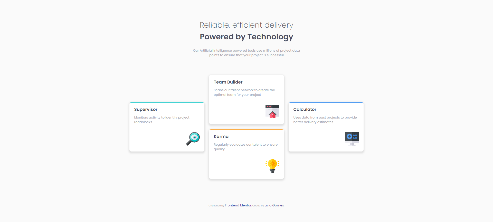

# Frontend Mentor - Four card feature section solution

This is a solution to the [Four card feature section challenge on Frontend Mentor](https://www.frontendmentor.io/challenges/four-card-feature-section-weK1eFYK). Frontend Mentor challenges help you improve your coding skills by building realistic projects.

## Table of contents

- [Overview](#overview)
  - [The challenge](#the-challenge)
  - [Screenshot](#screenshot)
  - [Links](#links)
- [My process](#my-process)
  - [Built with](#built-with)
  - [What I learned](#what-i-learned)
  - [Continued development](#continued-development)
  - [Useful resources](#useful-resources)
- [Author](#author)

## Overview

### The challenge

Users should be able to:

- View the optimal layout for the site depending on their device's screen size

### Screenshot



### Links

- [Solution URL](https://github.com/liviagomesa/four-cards-section)
- [Live Site URL](https://liviagomesa.github.io/four-cards-section/)

## My process

It took me 3,5 hours to complete this challenge.

### Built with

- Semantic HTML5 markup
- CSS custom properties
- CSS Grid
- Mobile-first workflow

### What I learned

1. I've practiced how to use emmet in VS Code. For example, section\*3>h3+p becomes:

```html
<section>
  <h3></h3>
  <p></p>
</section>
<section>
  <h3></h3>
  <p></p>
</section>
<section>
  <h3></h3>
  <p></p>
</section>
```

2. I've reinforced the importance of the use of landmarks in the html code.

3. Using text-align on the img element doesn't work because the image element occupies exactly the size of the image, i.e., there is no free space for the image to move. Therefore, choose a large parent element (you can create a div element for example) and use text-align on this element (the effect will be to center all your content in its area coverage).

4. Direct child elements of the grid container automatically become grid items.
   You can set only one grid-template columns value. If you have more direct children than columns, it will automatically create a new row and start filling it from left to right.
   The direct children occupy the entire cell. If you have a cell larger than the others in your row/column, these cells will increase to the same width/height as this one. This way, the children of the grid container all have the same dimensions, always.
   However, its content (i.e., children's children) will continue to occupy an "auto" dimension (i.e., enough to fit its content). So in these cases, you may notice a blank space in your cell (below or to the right).
   So, if you want the children of the grid container not to expand, creating this blank space, one strategy is to define a div parent which will become the new container's child.

5. Instead of creating a div to the colored bars, it would be simpler to define a top border, like this:
   ```css
   border-top: 3px solid red;
   ```

### Continued development

I'm not completely comfortable with the concepts and techniques below - but I think they're useful and I want to refine by focusing in future projects:

- defining page's layout (columns and rows)
- content overflow

### Useful resources

- [CSS Grid Container - w3schools](https://www.w3schools.com/css/css_grid_container.asp)

## Author

- Frontend Mentor - [@liviagomesa](https://www.frontendmentor.io/profile/liviagomesa)
- LinkedIn - [@liviagomesa](https://www.linkedin.com/in/liviagomesa/)
